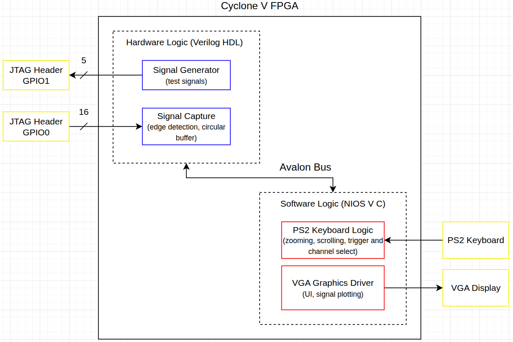

# Logic Analyzer (DE1-SoC, Nios V)

Logic Analyzer that samples digital signals on 16 channels from the GPIO expansion header. It polls the input pins to capture signal data and stores it in a circular buffer. The signals are plotted on the VGA and the display is controlled with a PS2 keyboard. Features include adjustable time division and vertical scale, time measurement cursor, and selectable trigger channel. The channel capture logic was implemented on the FPGA hardware and the display logic runs on the Nios V processor.

## Block Diagram

## Overview

### UI Display (Top Status Bar)
- Time per division (ns/div)
- Sampling frequency (MHz)
- Number of visible samples
- Time offset from trigger (ns)

### Signal Display
- 16 total channels
- 8 channels displayed per page
- Page toggled using `Tab`

### Interaction
- Fully keyboard-controlled (PS/2 interface)

## Controls

### Channel Selection
- Active channel shown on HEX display (0–7 per page)
- No-selection state:
  - Triggered by `Esc` or navigating off-screen
  - HEX display cleared

### Navigation
- `↑ / ↓` → move between channels  
- `0–7` → direct channel selection  

### Channel Control
- `Space` or `E` → enable/disable selected channel  

## Control Functions
- `S` → start acquisition + waveform display  
- `T` → set trigger channel (current selection)  
- `C` → clear all signals + reset analyzer  
- `Esc` → deselect channel  
- `Tab` → toggle between channel pages (0–7, 8–15)  

## Zoom & Time Scaling

- Controlled using `+` and `-`
- Discrete zoom levels (samples): {64, 96, 256, 512, 1024}
- Time/div is dynamically computed from:
  - Sampling frequency
  - Visible sample window

## Time Axis

- Horizontal time scale rendered across screen  
  - Range: [0, 39,000] ns
  - Derived from buffer size and sampling rate  

## Logic Analyzer Parallel Port

<table style="border-collapse: collapse; background: transparent;">
<tbody style="background: transparent;">
<tr style="background: transparent;">
<th style="border: 1px solid #777; padding: 8px 12px; text-align: center; white-space: nowrap; background: transparent;">Address</th>
<th style="border: 1px solid #777; padding: 8px 10px; text-align: center; white-space: nowrap; background: transparent;">31 ... 16</th>
<th style="border: 1px solid #777; padding: 8px 10px; text-align: center; white-space: nowrap; background: transparent;">15 ... 3</th>
<th style="border: 1px solid #777; padding: 8px 12px; text-align: center; background: transparent;">2</th>
<th style="border: 1px solid #777; padding: 8px 12px; text-align: center; background: transparent;">1</th>
<th style="border: 1px solid #777; padding: 8px 12px; text-align: center; background: transparent;">0</th>
<th style="border: 1px solid #777; padding: 8px 12px; text-align: center; white-space: nowrap; background: transparent;">Registers</th>
</tr>
<tr style="background: transparent;">
<td style="border: 1px solid #777; padding: 14px; text-align: center;"><strong>0x80400000</strong></td>
<td colspan="4" style="border: 1px solid #777; padding: 14px; text-align: center; background-color: rgba(128, 128, 128, 0.15);"><em>Unused</em></td>
<td style="border: 1px solid #777; padding: 14px; text-align: center;"><code>RUN</code></td>
<td style="border: 1px solid #777; padding: 14px; text-align: center; white-space: nowrap; background: transparent;">Control</td>
</tr>
<tr style="background: transparent;">
<td style="border: 1px solid #777; padding: 14px; text-align: center;"><strong>0x80400004</strong></td>
<td colspan="2" style="border: 1px solid #777; padding: 14px; text-align: center; background-color: rgba(128, 128, 128, 0.15);"><em>Unused</em></td>
<td style="border: 1px solid #777; padding: 14px; text-align: center;"><code>TRIG</code></td>
<td style="border: 1px solid #777; padding: 14px; text-align: center;"><code>FULL</code></td>
<td style="border: 1px solid #777; padding: 14px; text-align: center;"><code>RUN</code></td>
<td style="border: 1px solid #777; padding: 14px; text-align: center; white-space: nowrap; background: transparent;">Status</td>
</tr>
<tr style="background: transparent;">
<td style="border: 1px solid #777; padding: 14px; text-align: center;"><strong>0x80400008</strong></td>
<td colspan="1" style="border: 1px solid #777; padding: 14px; text-align: center; background-color: rgba(128, 128, 128, 0.15);"><em>Unused</em></td>
<td colspan="4" style="border: 1px solid #777; padding: 14px; text-align: center;"><code>TRIGGER_CHANNEL [15:0]</code></td>
<td style="border: 1px solid #777; padding: 14px; text-align: center; white-space: nowrap; background: transparent;">Trigger Config</td>
</tr>
<tr style="background: transparent;">
<td style="border: 1px solid #777; padding: 14px; text-align: center;"><strong>0x8040000C</strong></td>
<td colspan="1" style="border: 1px solid #777; padding: 14px; text-align: center; background-color: rgba(128, 128, 128, 0.15);"><em>Unused</em></td>
<td colspan="4" style="border: 1px solid #777; padding: 14px; text-align: center;"><code>BUFFER_DATA [15:0]</code></td>
<td style="border: 1px solid #777; padding: 14px; text-align: center; white-space: nowrap; background: transparent;">Buffer Window</td>
</tr>
<tr style="background: transparent;">
<td style="border: 1px solid #777; padding: 14px; text-align: center;"><strong>0x80400010</strong></td>
<td colspan="1" style="border: 1px solid #777; padding: 14px; text-align: center; background-color: rgba(128, 128, 128, 0.15);"><em>Unused</em></td>
<td colspan="4" style="border: 1px solid #777; padding: 14px; text-align: center;"><code>TRIGGER_PTR [15:0]</code></td>
<td style="border: 1px solid #777; padding: 14px; text-align: center; white-space: nowrap; background: transparent;">Trigger Pointer</td>
</tr>
<tr style="background: transparent;">
<td style="border: 1px solid #777; padding: 14px; text-align: center;"><strong>0x80400014</strong></td>
<td colspan="1" style="border: 1px solid #777; padding: 14px; text-align: center;"><code>POST_COUNT [15:0]</code></td>
<td colspan="4" style="border: 1px solid #777; padding: 14px; text-align: center;"><code>PRE_COUNT [15:0]</code></td>
<td style="border: 1px solid #777; padding: 14px; text-align: center; white-space: nowrap; background: transparent;">Samples</td>
</tr>
</tbody>
</table>

### Register behaviour

<strong>Control:</strong> Write a 1 to the RUN bit in the idle state to start sampling. Write a 0 to the RUN bit after the FULL bit goes high to reset to the idle state.
 
 
<strong>Status:</strong> Read-only. RUN: high when sampling, low when in idle state. FULL: high when the internal buffer is full. TRIG: high after the rising edge trigger condition is detected.
 
 
<strong>Trigger Config:</strong> Write a 16 bit unsigned integer to set the channel to trigger on.
 
 
<strong>Buffer Window:</strong> The bottom 16 bits return the value of the buffer at the internal read_pointer index. Reading from this register auto-increments the internal read_pointer. Writing any value to this register resets the read_pointer back to 0.
 
 
<strong>Trigger Pointer:</strong> Read-only. Returns a 16 bit unsigned integer corresponding to the buffer index when the trigger condition was detected.
 
 
<strong>Samples:</strong> Read-only. The top 16 bits encode the number of post-trigger samples collected. The bottom 16 bits encode the number of pre-trigger samples collected.
 

## JTAG Header Assignments

## Bugs
- The trigger marker is not always aligned with the trigger point (supposed to be aligned to a rising edge); could be an issue with how the trigger index is stored in hardware.
- Time division is off by a factor of 2 (a 1 MHz clock is shown to have a period of 500ns instead of 1000ns); likely a mismatch between hardware sampling rate and software time division calculations.

## Other Notes
- Uses VGA frame buffer + character buffer for rendering  
- Modular design (UI, logic, hardware separated)
