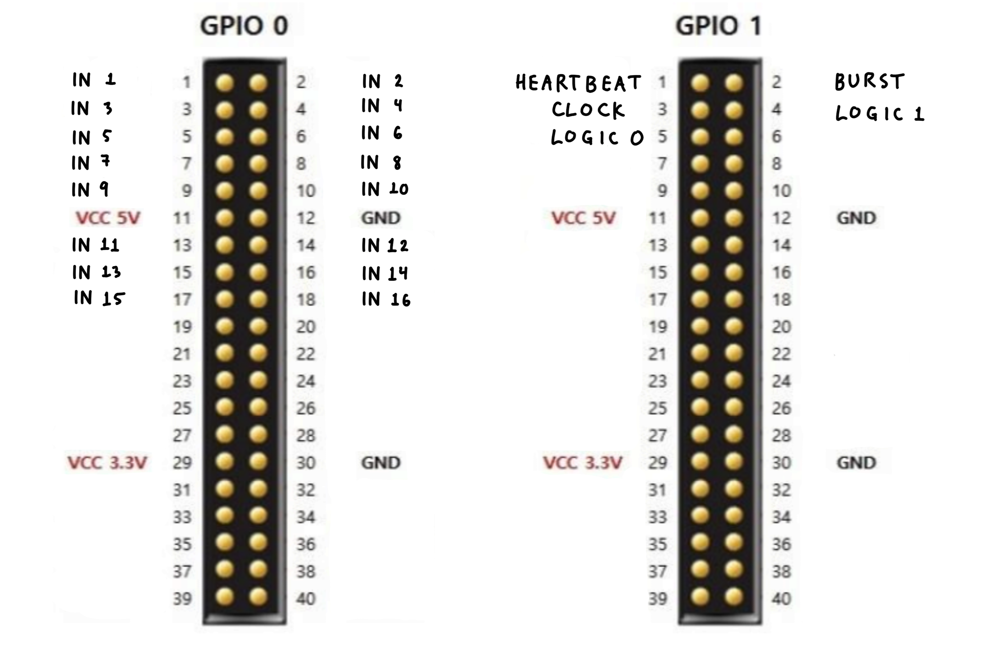

### Logic Analyzer Parallel Port

<table style="border-collapse: collapse; background: transparent;">
<tbody style="background: transparent;">
<tr style="background: transparent;">
<th style="border: 1px solid #777; padding: 8px 12px; text-align: center; white-space: nowrap; background: transparent;">Address</th>
<th style="border: 1px solid #777; padding: 8px 10px; text-align: center; white-space: nowrap; background: transparent;">31 ... 16</th>
<th style="border: 1px solid #777; padding: 8px 10px; text-align: center; white-space: nowrap; background: transparent;">15 ... 3</th>
<th style="border: 1px solid #777; padding: 8px 12px; text-align: center; background: transparent;">2</th>
<th style="border: 1px solid #777; padding: 8px 12px; text-align: center; background: transparent;">1</th>
<th style="border: 1px solid #777; padding: 8px 12px; text-align: center; background: transparent;">0</th>
<th style="border: 1px solid #777; padding: 8px 12px; text-align: center; white-space: nowrap; background: transparent;">Registers</th>
</tr>
<tr style="background: transparent;">
<td style="border: 1px solid #777; padding: 14px; text-align: center;"><strong>0xFF205000</strong></td>
<td colspan="4" style="border: 1px solid #777; padding: 14px; text-align: center; background-color: rgba(128, 128, 128, 0.15);"><em>Unused</em></td>
<td style="border: 1px solid #777; padding: 14px; text-align: center;"><code>RUN</code></td>
<td style="border: 1px solid #777; padding: 14px; text-align: center; white-space: nowrap; background: transparent;">Control</td>
</tr>
<tr style="background: transparent;">
<td style="border: 1px solid #777; padding: 14px; text-align: center;"><strong>0xFF205004</strong></td>
<td colspan="2" style="border: 1px solid #777; padding: 14px; text-align: center; background-color: rgba(128, 128, 128, 0.15);"><em>Unused</em></td>
<td style="border: 1px solid #777; padding: 14px; text-align: center;"><code>TRIG</code></td>
<td style="border: 1px solid #777; padding: 14px; text-align: center;"><code>FULL</code></td>
<td style="border: 1px solid #777; padding: 14px; text-align: center;"><code>RUN</code></td>
<td style="border: 1px solid #777; padding: 14px; text-align: center; white-space: nowrap; background: transparent;">Status</td>
</tr>
<tr style="background: transparent;">
<td style="border: 1px solid #777; padding: 14px; text-align: center;"><strong>0xFF205008</strong></td>
<td colspan="1" style="border: 1px solid #777; padding: 14px; text-align: center; background-color: rgba(128, 128, 128, 0.15);"><em>Unused</em></td>
<td colspan="4" style="border: 1px solid #777; padding: 14px; text-align: center;"><code>TRIGGER_CHANNEL [15:0]</code></td>
<td style="border: 1px solid #777; padding: 14px; text-align: center; white-space: nowrap; background: transparent;">Trigger Config</td>
</tr>
<tr style="background: transparent;">
<td style="border: 1px solid #777; padding: 14px; text-align: center;"><strong>0xFF20500C</strong></td>
<td colspan="1" style="border: 1px solid #777; padding: 14px; text-align: center; background-color: rgba(128, 128, 128, 0.15);"><em>Unused</em></td>
<td colspan="4" style="border: 1px solid #777; padding: 14px; text-align: center;"><code>BUFFER_DATA [15:0]</code></td>
<td style="border: 1px solid #777; padding: 14px; text-align: center; white-space: nowrap; background: transparent;">Buffer Window</td>
</tr>
<tr style="background: transparent;">
<td style="border: 1px solid #777; padding: 14px; text-align: center;"><strong>0xFF205010</strong></td>
<td colspan="1" style="border: 1px solid #777; padding: 14px; text-align: center; background-color: rgba(128, 128, 128, 0.15);"><em>Unused</em></td>
<td colspan="4" style="border: 1px solid #777; padding: 14px; text-align: center;"><code>TRIGGER_PTR [15:0]</code></td>
<td style="border: 1px solid #777; padding: 14px; text-align: center; white-space: nowrap; background: transparent;">Trigger Pointer</td>
</tr>
<tr style="background: transparent;">
<td style="border: 1px solid #777; padding: 14px; text-align: center;"><strong>0xFF205014</strong></td>
<td colspan="1" style="border: 1px solid #777; padding: 14px; text-align: center;"><code>POST_COUNT [15:0]</code></td>
<td colspan="4" style="border: 1px solid #777; padding: 14px; text-align: center;"><code>PRE_COUNT [15:0]</code></td>
<td style="border: 1px solid #777; padding: 14px; text-align: center; white-space: nowrap; background: transparent;">Samples</td>
</tr>
</tbody>
</table>

 
<strong>Control:</strong> Write a 1 to the RUN bit in the idle state to start sampling. Write a 0 to the RUN bit after the FULL bit goes high to reset to the idle state.
 
 
<strong>Status:</strong> Read-only. RUN: high when sampling, low when in idle state. FULL: high when the internal buffer is full. TRIG: high after the rising edge trigger condition is detected.
 
 
<strong>Trigger Config:</strong> Write a 16 bit unsigned integer to set the channel to trigger on.
 
 
<strong>Buffer Window:</strong> The bottom 16 bits return the value of the buffer at the internal read_pointer index. Reading from this register auto-increments the internal read_pointer. Writing any value to this register resets the read_pointer back to 0.
 
 
<strong>Trigger Pointer:</strong> Read-only. Returns a 16 bit unsigned integer corresponding to the buffer index when the trigger condition was detected.
 
 
<strong>Samples:</strong> Read-only. The top 16 bits encode the number of post-trigger samples collected. The bottom 16 bits encode the number of pre-trigger samples collected.
 

---

### JTAG Header Assignments

